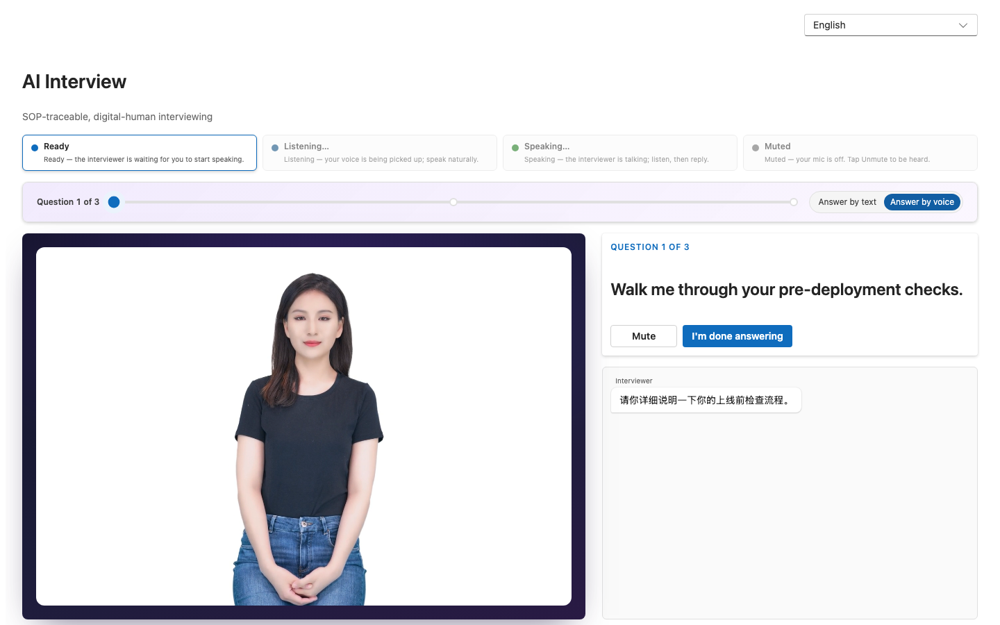
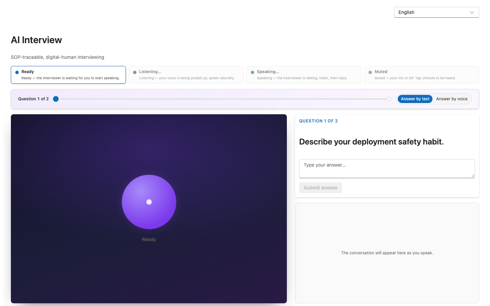
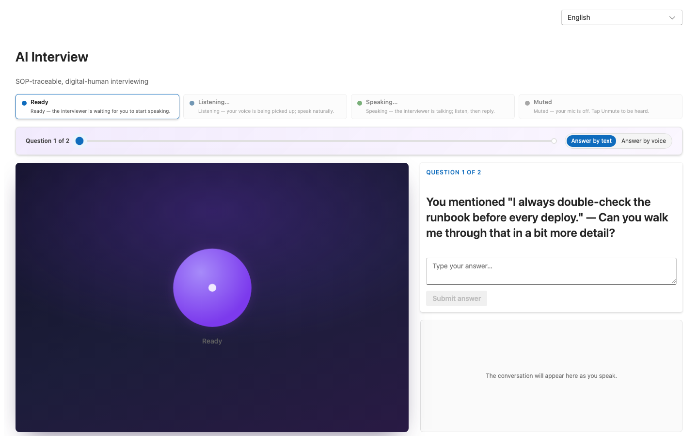
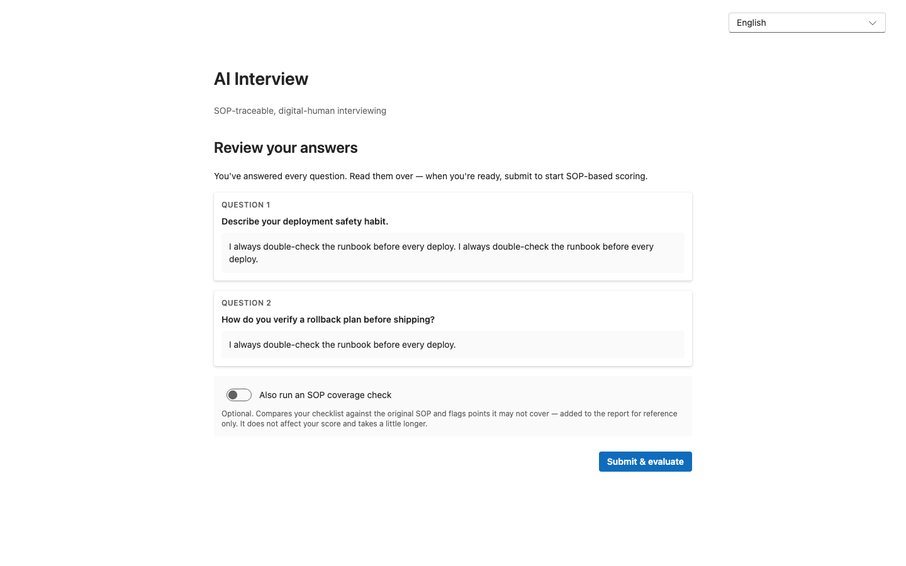
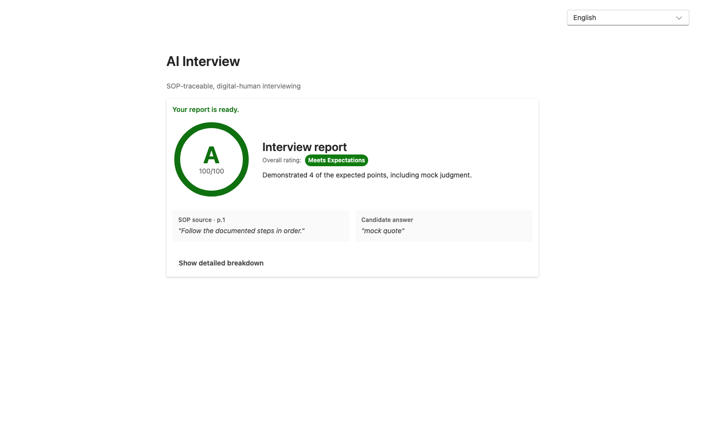
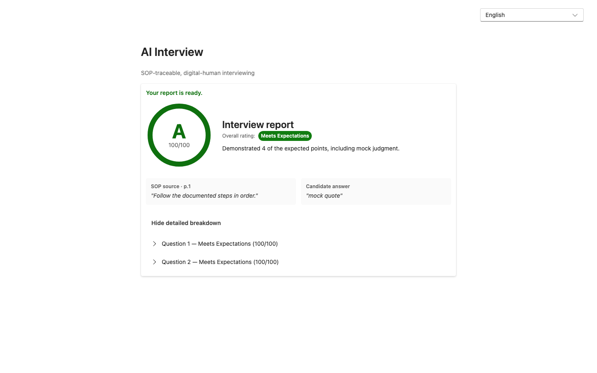
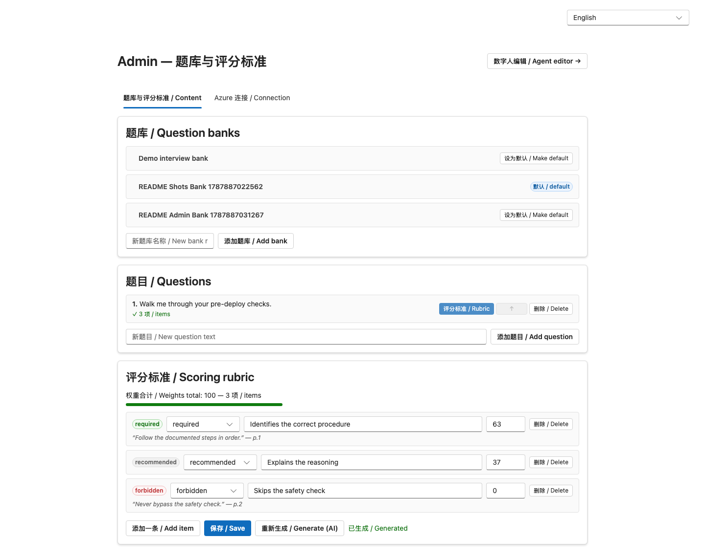
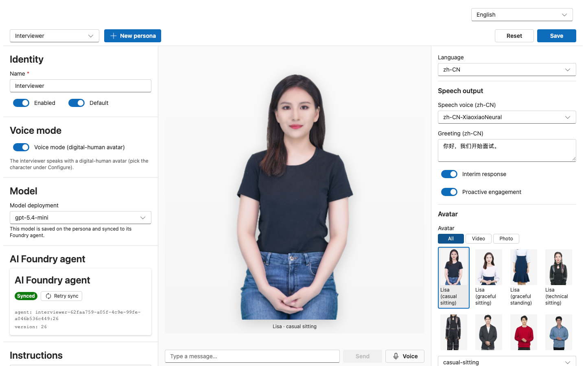

# AI Interview

An SOP-based interview web app with an **AI digital-human interviewer** — built as a sales PoC to
production standard. A candidate is interviewed by a live avatar (Azure Voice Live + Azure AI
Foundry agent), answers by voice or text, gets a follow-up that cites their own earlier answer
(session memory), and receives an on-the-spot report where every judgment traces back to the
client's own SOP document — **document name + page, item by item**.

> This repo is public: it contains no client names, no real SOP content, and no candidate data.
> Everything runs on mock providers by default — **zero Azure needed** to build, test, or demo.

**Four capabilities demonstrated:** AI · digital human · RAG · memory.
The differentiator is **SOP-traceable, source-cited compliance scoring**: the system scores whether
answers comply with the client's *own* SOP, and every judgment points back to its source.

## Key scenarios

### 1. The interview — digital-human interviewer, voice mode

In voice mode the candidate is interviewed face-to-face: Azure Voice Live streams a live 1080p
digital-human avatar that **speaks each question aloud** (captured below against real Azure — the
question is spoken in the persona's language while the pinned question stays authoritative), the
candidate answers by speaking, and the conversation transcript builds on the right. A status
legend shows the live voice state (ready / listening / speaking / muted).



### 1b. Text mode — same flow, no Azure needed

Every question can also be answered by text; on mock providers the avatar stage falls back to the
audio orb, so the whole flow runs with zero Azure:



### 2. Session memory — the follow-up quotes the candidate

After an answer, the interviewer can ask a follow-up that **cites the candidate's own words** —
the visible "memory moment" of the demo:



### 3. Review before scoring — explicit submit

After the last question the candidate reviews every answer in order; scoring starts only on an
explicit **Submit & evaluate** click (with an optional SOP coverage check):



### 4. The report — SOP-cited compliance scoring

The executive view leads with a classification rating (*Meets Expectations / Needs Improvement /
Does Not Meet*) on a score gauge, and shows the **SOP source (document + page) beside the
candidate's answer** — the traceability claim, on screen. A detailed per-question,
per-checklist-item breakdown is one click away, and each SOP citation links to the original
source document.





### 5. Admin — question banks & AI-drafted scoring rubrics

Admins author question banks and per-question checklists. Checklists are **AI-drafted from the
SOP** (required / recommended / forbidden items, each with a source quote + page), weights
normalized to 100, fully editable:



### 6. Admin — Foundry agent persona editor

A portal-faithful editor for the interviewer persona: model deployment, voice, greeting, the full
Azure avatar roster (video + photo styles), tools, per-persona knowledge — synced to a real
**Azure AI Foundry agent**, with an inline text/voice playground:



## Architecture

```
frontend  React 18 + TypeScript + Vite + Fluent UI v9 · TanStack Query · i18next (zh-CN / en-US)
backend   Python 3.11 + FastAPI + SQLAlchemy 2.0 async + Alembic · JWT auth
azure     AI Foundry agents (Responses API) · Voice Live (avatar, via a backend WS proxy)
          · Foundry IQ / AI Search (RAG with strict citation gating) · Blob Storage
infra     Azure Container Apps (Sweden Central) · Bicep · GitHub Actions OIDC (keyless)
```

- **Provider abstraction** — LLM / retrieval / voice each have a `mock` and an `azure`
  implementation; local dev and the whole CI suite run entirely on mocks.
- **Voice transport** — the browser talks to `/api/voice-live/ws`; the backend proxy holds the
  Azure Voice Live SDK connection, so avatar ICE/SDP, transcripts, and audio relay over one socket.
- **Config precedence** — DB-backed `ServiceConfig` (set in `/admin`, keys encrypted) > `.env` >
  code default.
- **Candidate privacy boundary (P3)** — the candidate API never exposes rubric/checklist content;
  enforced by tests.

## Quickstart (zero Azure, mock providers)

**Backend** (Python 3.11+):

```bash
cd backend
python -m venv .venv && source .venv/bin/activate
pip install -e ".[dev]"
alembic upgrade head
uvicorn app.main:app --reload            # http://localhost:8000
```

**Frontend** (Node 20+):

```bash
cd frontend
npm install
npm run dev                              # http://localhost:5173 (proxies /api → :8000)
```

Open `http://localhost:5173/interview` for the candidate flow. Admin surfaces are at `/admin`
(banks + rubrics + Azure config) and `/admin/agent` (persona editor); seed an admin user via
`SEED_ADMIN_USERNAME` / `SEED_ADMIN_PASSWORD` env vars on backend boot.

For a **real Azure** run, copy `backend/.env.example` → `backend/.env` and fill in the Foundry /
Voice Live / Search values (or configure them in the `/admin` UI). The model must be a deployment
that exists on your resource.

## Testing

```bash
cd backend && pytest                     # 460+ tests, ~86% coverage
cd frontend && npm test                  # vitest unit/component tests
cd frontend && npm run e2e               # Playwright E2E — boots both servers, real Chromium, zero Azure
```

CI gates every commit on ruff (check + format), pytest, tsc, eslint, vitest, and the Playwright
E2E suite. Live-Azure validation happens through opt-in specs (e.g. `LIVE_VOICE=1`) that self-skip
in CI.

The README screenshots regenerate with:

```bash
# Mock-stack scenarios (zero Azure; boots its own servers)
cd frontend && SCREENSHOTS=1 npx playwright test e2e/readme-screenshots.spec.ts

# Live avatar shot (real dev servers on :5173/:8000 with real Foundry credentials)
cd frontend && LIVE_VOICE=1 SCREENSHOTS=1 npx playwright test readme-live-screenshots --config=e2e/live.config.ts
```

## Deployment

CI/CD deploys to **Azure Container Apps** via GitHub Actions with OIDC federated identity — no
stored cloud credentials, managed identity everywhere, keyless. See
[`infra/azure/README.md`](infra/azure/README.md) for one-time setup and
[`docs/planning/spec-azure-cicd-deploy.md`](docs/planning/spec-azure-cicd-deploy.md) for the design.

## Documentation

| Doc | What it covers |
|---|---|
| [`SPEC.md`](SPEC.md) | The authoritative living technical spec (9 features, quality bar, privacy rules) |
| [`docs/IMPLEMENTATION-STATUS.md`](docs/IMPLEMENTATION-STATUS.md) | Feature-by-feature status, shipped versions, live-Azure validation state |
| [`docs/VERIFICATION.md`](docs/VERIFICATION.md) | How to verify the requirements and run the system |
| [`docs/planning/`](docs/planning/) | Spec lineage: design docs, plans, and reviews |
| [`CHANGELOG.md`](CHANGELOG.md) | Per-release detail |
