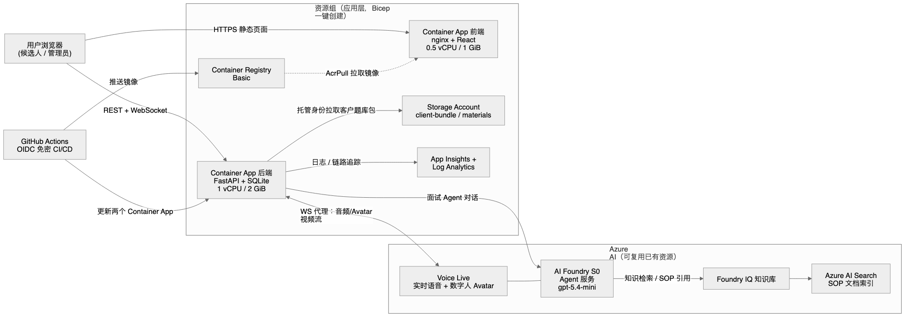

# Azure 资源清单与推荐配置（客户预算 / 资源申请用）

> 本文档面向客户的预算评估与资源申请流程，列出部署 AI-interview 所需的全部 Azure 资源、
> 当前验证环境（Sweden Central 公开演示环境，v0.31+）实际采用的规格，以及生产化的推荐升级项。
> 所有价格仅为量级参考，请以 [Azure 定价计算器](https://azure.microsoft.com/pricing/calculator/)
> 按目标区域和 EA/CSP 折扣核算为准。

## 架构总览

（源文件：[azure-architecture.mmd](azure-architecture.mmd)，可编辑版 [azure-architecture.excalidraw](azure-architecture.excalidraw) 可在 excalidraw.com 打开修改。）

## 一、区域选择

推荐 **Sweden Central**（或其他同时提供以下能力的区域）。选区域的硬约束是
**Azure AI Foundry Voice Live（实时语音 + 数字人 Avatar）** 与目标 GPT 模型的可用性，
其余资源全区域可用。应用资源与 Foundry 资源应同区域部署以降低语音链路延迟。

## 二、核心资源清单（应用层，IaC 自动创建）

对应 `infra/azure/main.bicep`，一次 `az deployment sub create` 创建全部：

| # | 资源 | 已验证规格 | 用途 | 月成本量级* |
|---|------|-----------|------|------------|
| 1 | Container Apps Environment | Consumption 型、非区域冗余 | 应用托管环境 | 按用量计入 2/3 |
| 2 | Container App — backend | 1 vCPU / 2 GiB，min=max=1 副本 | FastAPI 后端 + Voice Live WS 代理 | ~$50 |
| 3 | Container App — frontend | 0.5 vCPU / 1 GiB，min=max=1 副本 | React 前端（nginx） | ~$25 |
| 4 | Container Registry | **Basic** | 后端/前端镜像 | ~$5 |
| 5 | Storage Account | **Standard_LRS**, StorageV2 | 私有 `client-bundle`（客户题库包）+ `materials` | <$5 |
| 6 | Log Analytics Workspace | PerGB2018 | 日志 | ~$2.3/GB，演示量级 <$10 |
| 7 | Application Insights | 基于 Log Analytics | 链路追踪/告警（含 Failure Anomalies 智能告警） | 计入 6 |
| 8 | User-assigned Managed Identity ×2 | — | 后端免密访问 Foundry/Storage；GitHub OIDC 免密部署 | 免费 |
| 9 | 角色分配（RBAC） | AcrPull、Storage Blob Data Reader、Contributor、AcrPush | 免密（keyless）运行与部署 | 免费 |

*应用层合计约 **$85–100/月**（单副本常驻、演示负载）。

**刻意不部署的组件**（演示环境的成本取舍，生产化建议见第五节）：

- **数据库 PaaS**：应用运行在副本本地的**临时 SQLite** 上，每次启动重建并自动播种。
- **Key Vault**：4 个运行时密钥用 Container App 原生 secrets（平台静态加密）。
  注：部分受管订阅（如 MCAPS）的 Azure Policy 会强制关闭 Key Vault/Storage 的公网访问，
  无 VNet 的 Container App 无法访问 —— 申请订阅时需确认策略约束。
- **VNet / Private Endpoint**：全公网 ingress。

## 三、AI 能力资源（核心成本项，可复用已有资源）

| 资源 | 已验证规格 | 用途 |
|------|-----------|------|
| Azure AI Foundry（AI Services 账户） | **S0**，Sweden Central | Agent 服务 + 模型推理 + Voice Live |
| Azure AI Search | **Basic 起步；生产建议 Standard S1** | Foundry IQ 知识库（SOP 引用/citation 检索） |

### 必需的模型部署（在 Foundry 账户内）

| 模型部署 | SKU | 已验证容量 | 用途 |
|----------|-----|-----------|------|
| `gpt-5.4-mini` | GlobalStandard | 200+ K TPM | 面试 Agent 主模型 + Voice Live 对话模型 |
| `text-embedding-3-small` | GlobalStandard | ~120 K TPM | 知识库向量化 |

> 容量建议：单并发面试会话对 TPM 要求不高，上表容量可支撑约 5–10 路并发语音面试。
> 客户可先按 **100K TPM（主模型）+ 50K TPM（embedding）** 申请，按并发线性上调。

### AI 用量成本（按量计费，随使用量变化）

预算时按"每场 30 分钟语音面试"估算三部分：

1. **模型 token**（gpt-5.4-mini 输入/输出 token）；
2. **Voice Live 语音**（实时 STT/TTS，按音频分钟计费；启用**数字人 Avatar 视频**为更高档位）;
3. **AI Search**：Basic ~$75/月、Standard S1 ~$250/月（固定月费为主）。

量级参考：轻度 PoC 使用（每天数场面试）AI 用量通常在 **$100–300/月**；
Avatar 视频是其中最大的可变项，纯语音（orb 模式）可显著降低。

## 四、配套（非 Azure 资源，零成本但需申请权限）

| 项 | 说明 |
|----|------|
| GitHub 仓库 + Actions | CI/CD；经 **OIDC federated credential** 免密登录 Azure（无需保存任何密钥） |
| 部署权限 | 一次性 IaC 部署需订阅 **Owner**（或 UAA+Contributor）；日常 CI/CD 只用受限的部署 MI |
| Foundry RBAC | 后端 MI 需在 Foundry 账户上授权（`scripts/grant-foundry-rbac.sh`），跨资源组时需对方 RG 的 Owner/UAA |

## 五、生产化推荐升级（预算加项）

演示环境为最小成本配置，正式对客上线建议按需加上：

| 升级项 | 推荐规格 | 月成本量级* | 解决的问题 |
|--------|---------|------------|-----------|
| Azure Database for PostgreSQL Flexible Server | B2s 起步（2 vCPU/4 GiB）+ 备份 | ~$60+ | 替换临时 SQLite，数据持久化、可多副本 |
| Container Apps 多副本 + 弹性伸缩 | min 2 / max 5，需先完成 DB 外置 | 按副本线性 | 高可用；注意 Voice Live WS 需要会话亲和 |
| VNet + Private Endpoint（Storage/KV/DB/Search） | — | ~$10/端点 + 流量 | 满足企业安全基线；解锁受策略限制订阅的私有 blob 通道 |
| Key Vault | Standard | <$5 | 密钥集中管理与轮转 |
| ACR Standard | — | ~$20 | 更大镜像配额 + geo 复制选项 |
| 区域冗余 / 多区域 | 按 SLA 要求评估 | — | 容灾 |
| Azure Front Door / 自定义域名 + WAF | Standard 档 | ~$35+ | 对客域名、防护、就近接入 |

## 六、预算汇总速查

| 场景 | 月成本量级* |
|------|------------|
| PoC / 演示（本仓库当前配置 + Search Basic） | **~$160–200 + AI 用量（$100–300）** |
| 生产基线（+Postgres、双副本、KV、VNet、Front Door） | **~$450–600 + AI 用量（随并发增长）** |

*均为 pay-as-you-go 挂牌价量级（美元），未含协议折扣；AI 用量与面试场次、时长、是否启用 Avatar 视频强相关。

## 七、资源申请 checklist（给客户 IT/采购）

- [ ] 订阅具备（或可申请）目标区域的 **Azure OpenAI / AI Foundry 访问资格** 与模型配额（主模型 ≥100K TPM）
- [ ] 确认目标区域支持 **Voice Live**（含 Avatar，如需数字人视频）
- [ ] 订阅无阻断性 Azure Policy（重点：Storage/Key Vault 公网访问是否被强制关闭；若关闭需同时申请 VNet + Private Endpoint）
- [ ] 一次性部署账号的 **Owner/UAA** 权限（部署完成后可回收）
- [ ] GitHub 组织允许配置 **OIDC federated credential**（免密 CI/CD）
- [ ] AI Search 服务配额（Basic 起）

---
参考实现：`infra/azure/`（Bicep IaC + 部署说明）；已验证环境：Sweden Central，
Container Apps + 复用型 Foundry 资源，CI/CD 经 GitHub Actions OIDC 全免密部署。
