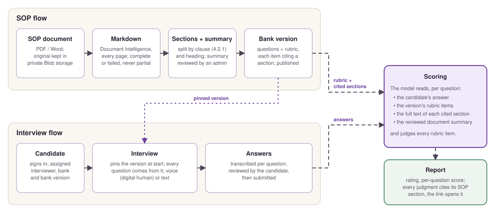
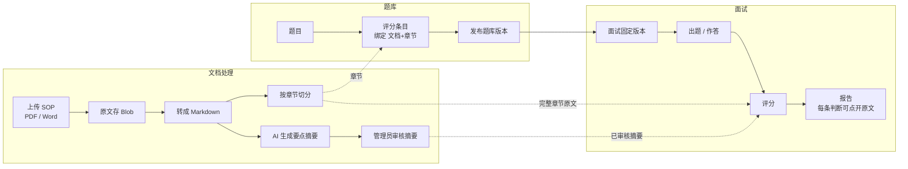
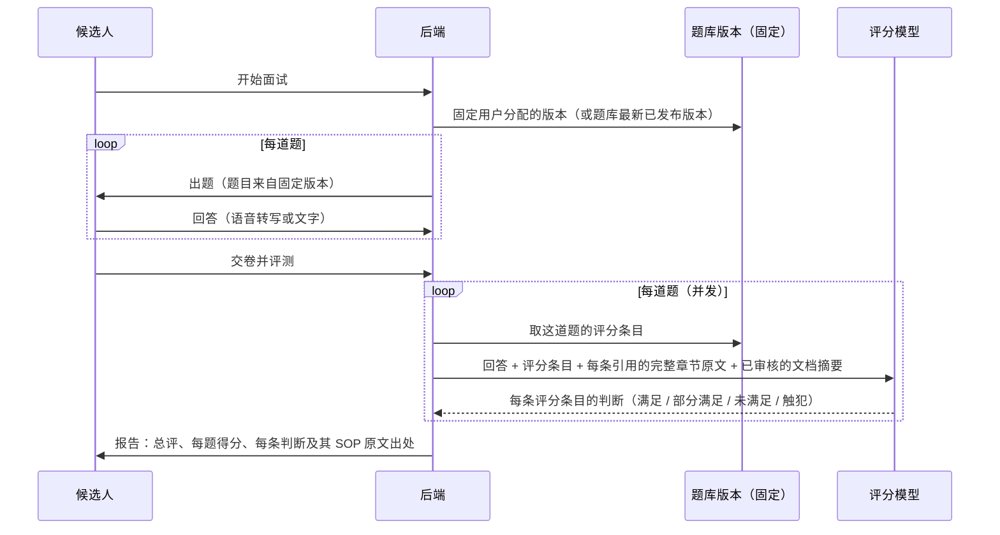

# SOP 文档处理与面试打分流程

本文说明一份 SOP 从上传到被用于给候选人打分的完整过程，以及一场面试是如何出题、评分、生成报告的。
设计依据：[`planning/spec-sop-section-grounding.md`](planning/spec-sop-section-grounding.md)（SOP 章节）和
[`planning/spec-bank-versioning.md`](planning/spec-bank-versioning.md)（题库版本）。

**状态说明**：这套流程分三个 PR 上线。下文每一步都标注了状态：✅ 已上线 · 🚧 进行中 · ⏳ 待做。

## 一、总览

两条线在评分处汇合：SOP 线把文档变成带章节的题库版本，面试线在这个版本上收集候选人的回答。

逐步展开：

## 二、文档处理流程

| 步骤 | 做什么 | 状态 |
|---|---|---|
| 1. 上传 | 后台上传 SOP（或启动时由私有导入程序导入客户资料） | ✅ |
| 2. 存原文 | 原始文件存进私有 Blob 容器 `materials`，后端用托管身份读写；浏览器拿不到直链，只能经后端打开报告里引用的那份文档 | ✅ v0.51.1.0 |
| 3. 转 Markdown | **PDF**：Azure Document Intelligence 版面分析，显式指定全部页码（`pages=1-N`）并开启高分辨率识别（`ocrHighResolution`），输出带标题层级、分页标记、页眉页脚标注的 Markdown。**要么全部成功，要么失败**：返回页数必须等于 PDF 页数，且每一页都要和 PDF 文字层逐页核对（只在该页及前后各一页的 Markdown 里找，覆盖率不低于 95%；中文按相邻两字核对），任一条不满足，整份文档判定为转换失败、不生成任何章节，原因显示在后台。**Word**：自有转换器，按 Word 自动编号计算章节号（如 Monitoring Plan 的 "12"），无标题样式时把全大写/整段加粗的短段落识别为标题，表格转成 Markdown 表格（合并单元格只写一次）；表单式表格（如岗位说明书里的 "General Description: …"）按每一行的标签切成章节 | ✅ v0.54.0.0（表单式表格 v0.55.0.0） |
| 4. 按章节切分 | 有编号的条目按编号定层级（`4` → `4.2` → `4.2.1`），无编号的标题按 Markdown 层级；去掉每页顶部/底部重复的页眉页脚；第一个标题之前的内容单独保留为导言 | ✅ v0.54.0.0 |
| 5. 后台转换 | 转换在服务启动后和每次上传后**后台**进行（每份 PDF 约 15 秒），被限流时按 `Retry-After` 等待重试，单份最长 10 分钟。转换失败的文档在下次启动或上传时自动重试；后台「重新转换」如果失败，保留上一次完整的转换结果，并显示失败原因 | ✅ v0.54.0.0 |
| 6. 要点摘要 | 转换完成后，AI 读取全文起草每份 SOP 的要点摘要（目的、适用范围、关键职责、必须遵守的要求；实测每份 16-30 秒）。管理员在「SOP 文档」页修改并点「审核通过」；**只有审核通过的摘要才用于评分**，草稿不用，修改已审核的摘要而不重新审核会退回草稿 | ✅ v0.55.0.0（评分接入 v0.56.0.0） |

**"完整章节"是什么**：一个章节的标题、本章节正文，加上它的**所有子章节**，按原文顺序拼接，**不截断**。
例如引用 4.2，交给模型的就是 4.2 以及 4.2.1、4.2.2、4.2.3…… 的全部内容。

**实测（26 份客户 SOP，2026-10-08）**：22 份 PDF 共 485 页，页数全部一致，每一页的真实内容都读到
（默认模式会漏掉密集表格页，例如 Training Matrix 第 3 页只读出 34 个词，所以必须开启高分辨率识别）；
切分后，Markdown 里的正文 100% 进入章节，表格完整保留，去掉的只有页眉页脚（保留第一次出现）；
题库 Source Hints 里引用的章节，资料中存在的 8/8 全部定位成功；另有 2 处引用的 "Country Quality Plan" 不在客户
提供的资料里。

**线上（2026-10-08，v0.54.0.0）**：部署后后台自动转换全部 26 份，22 份 Document Intelligence、4 份 Word，无一失败。

## 三、题库与评分标准

| 步骤 | 做什么 | 状态 |
|---|---|---|
| 1. 题目 | 后台编辑题目，或导入题库 bundle | ✅ |
| 2. 评分条目 | 每道题若干条：必须项 / 加分项 / 禁止项（含"仅提示、不扣分"），权重合计 100 | ✅ |
| 3. 绑定章节 | 每条评分条目引用一个或多个"文档 + 章节号"；评分时读取每个引用章节的完整原文。后台评分标准编辑器里每条显示所引用的章节，「+ 引用章节」先选文档再选章节；引用了已不存在的章节会提示并在保存时去掉 | ✅ v0.56.0.0 |
| 4. AI 起草评分标准 | 在自有 SOP 章节中检索，把章节原文交给模型起草；模型给出的引用必须逐字出现在原文里，否则丢弃；检索不到就如实标明"未找到相关 SOP" | ⏳ 下一版（现状：引用的是不存在的 "SOP Handbook"，见下） |
| 5. 重新定位引用 | 对已有评分标准批量补上正确章节（rf-CSM 从 "section 4.2" 这类标签解析章节号），结果写入草稿，管理员检查后发布 | ⏳ 下一版 |
| 6. 发布版本 | 一套题目 + 一套评分标准作为一个整体冻结成版本；发布前检查每道启用的题都有评分标准、权重合计 100 | ✅ v0.53.0.0 |

**当前已知问题（PR 3 修复前）**：
- 后台「AI 生成评分标准」引用的是一份**不存在的 "SOP Handbook"**：线上没有配置知识库，检索退回到了内置的假数据。
- rf-CSM 的评分条目绑定了真实文档，但"引用原文"只是出处标签（如 "…SOP section 4.2"），评分时取到的是
  文档**开头**约 600 字，不是对应章节。

## 四、面试打分流程

- **固定版本**：面试开始时固定一个已发布版本，出题、中断恢复、交卷前回看、评分、报告里的 SOP 链接**全部只读这个版本**。
  之后修改题库、发布新版本、重新导入，都不影响这场面试。（✅ v0.53.0.0）
- **评分时模型看到什么**：候选人的回答、这道题的评分条目、每条条目引用的**完整章节原文**、引用到的每份文档的**已审核摘要**。
  同一章节在一道题里只发送一次；不截断，单题超过 60,000 字时记警告（实测 60,000 字评分 12-14 秒，与 15,000 字相同）。（✅ v0.56.0.0；已有评分标准的引用待「重新定位引用」补齐，见上一节）
- **SOP 覆盖率检查**（可选）：检查评分标准有没有漏掉 SOP 里的要点，它审查的是评分标准本身，不是候选人的回答。
  详见 [`sop-coverage-audit.md`](sop-coverage-audit.md)。
- **实时 judge**：面试中候选人停顿时决定是否轻声提示"请继续"，只做节奏提示，不追问，也不使用 SOP。
- **报告**：每条判断都标出 SOP 出处，点击后经后端打开对应的原文文档（只能打开本场报告引用过的文档）。

## 五、数据存在哪里

| 数据 | 位置 |
|---|---|
| SOP 原始文件 | Blob 容器 `materials`（私有） |
| SOP 的 Markdown 全文、章节、要点摘要 | PostgreSQL：`sop_documents.markdown`、`sop_sections`、`sop_documents.summary`（含审核状态 `summary_status`） |
| 题目、评分条目（草稿） | PostgreSQL：`questions`、`checklists`、`checklist_items` |
| 已发布的题库版本 | PostgreSQL：`bank_versions`（题目 + 评分条目的冻结副本） |
| 面试记录、报告 | PostgreSQL：`interview_sessions`、`interview_turns`、`judge_events` |
